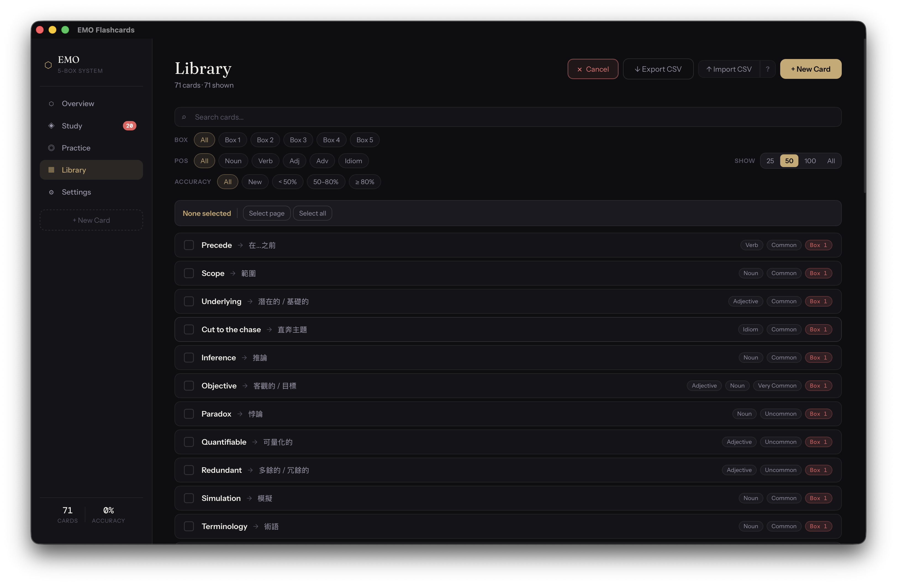

# Enhanced Memory Optimization (EMO)

Enhanced Memory Optimization (EMO) is based on the spaced repetition principle, aiming to improve long-term retention by adaptively scheduling reviews according to memory strength.



## Functions
- [X] Practice mode
    - [X] Flash card
    - [X] Word
    - [X] Meaning (* Better with GPU)
- [X] Study mode (Leitner System)
    - [X] Customize reviewing days
- [X] Export/Import words

## Meaning Mode Setup

Meaning mode uses [google/gemma-3-1b-it](https://huggingface.co/google/gemma-3-1b-it) to evaluate your answers locally. The model is downloaded once on first use and runs fully offline thereafter.

Because Gemma requires accepting a license agreement, a HuggingFace account and access token are needed for the initial download only.

### Steps

1. **Accept the license** — visit [huggingface.co/google/gemma-3-1b-it](https://huggingface.co/google/gemma-3-1b-it) and click *Agree and access repository*.

2. **Create an access token** — go to [huggingface.co/settings/tokens](https://huggingface.co/settings/tokens), click *New token*, select *Read* scope, and copy the token (starts with `hf_…`).

3. **Run setup in the app** — open EMO, navigate to Meaning mode, paste your token into the *HuggingFace Token* field, and click **Set Up Now**. The app will create a Python virtual environment and download the model (~1 GB). An internet connection is required only for this step.

After setup completes, the token is not stored — it is used only during the download.

## Install Issues:

### Issue 1: 
“LitAtlas.app” is damaged and can’t be opened. You should eject the disk image.

#### Reason: 
The downloaded unauthorized application will be quarantined by default.
#### Solution:  
```bash
# replace /Applications/YourAppName.app with actual APP path 
# (default will be /Applications/EMO Flashcards.app)
xattr -cr /Applications/YourAppName.app
```